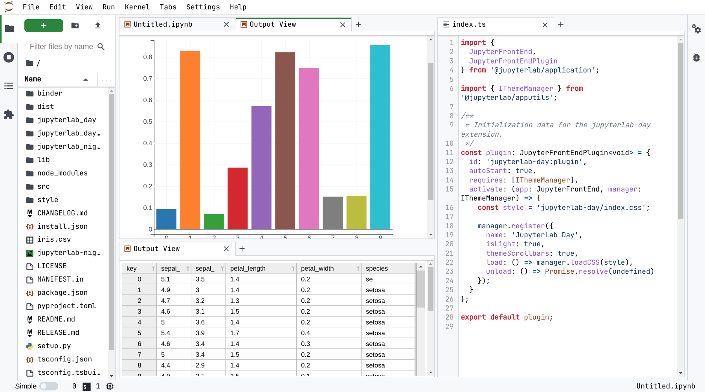

# jupyterlab-day

[](https://mybinder.org/v2/gh/martinRenou/jupyterlab-day/main?urlpath=lab)

JupyterLab light theme inspired by the Github light theme

See also [jupyterlab-night](https://github.com/martinRenou/jupyterlab-night).

## Requirements

* JupyterLab >= 3.0

## Install (coming soon)

<!-- To install the extension, execute:

```bash
conda install jupyterlab-day -c conda-forge
```

or

```bash
pip install jupyterlab-day
``` -->


